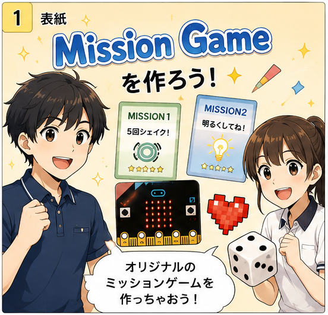
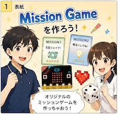
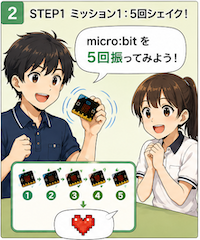
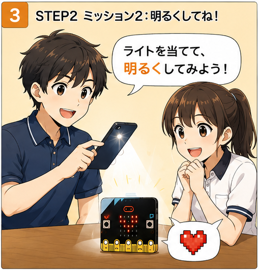
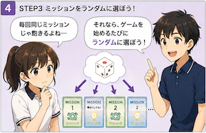
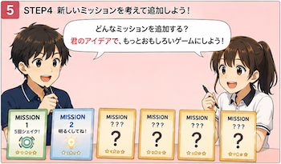

# Mission Game を作ろう！
##  Mission Game を作ろう！@unplugged

ゲーム会社から、新しいゲームの開発を依頼されました。

そのゲームは、micro:bitのセンサーを使って、さまざまなミッションに挑戦する「Mission Game」です。

まずは1つずつミッションを作り、少しずつ機能を追加していきましょう。

最後には、ミッションがランダムに選ばれる本格的なゲームへと発展させます。さらに、自分だけのオリジナルミッションも追加して、ゲームを完成させましょう。

このチュートリアルでは、ゲームを作りながら、ボタンやセンサー、変数、条件分岐、乱数など、プログラミングの基本を学びます。

 

 


## STEP 0 最初のミッション @unplugged

ゲーム会社から依頼が届きました。

    「5回シェイクしたらクリアできるミッションを作ってください。」

Aボタンを押すと、ミッション1がスタートします。
micro:bit を 5回ゆさぶってみましょう。
5回、ゆさぶられたことを検知したら、ミッションクリアです！




## STEP 1 最初のミッション @unplugged

ゲームを始める前、micro:bitはどんな状態でしょう？

* まだゲームは始まっていない
* ミッション中かもしれない
* クリアしたあとかもしれない

つまり、ゲームを作るには「今どんな状態か」を覚えておく必要があります。
そのために変数を mission を作って、以下のように状態を決めることにしましょう。


* mission = 0  ⇨ 待機中          
* mission = 1  ⇨  ミッション実行中  

## STEP 1-2 @unplugged

次に、ゲーム中に何回振ったかも覚える必要があるので、
shakeCount という変数を用意して初期値を0 にすることにします。


* shakeCount = 0 

``||input:ゆさぶられた||`` ことを検知したらカウントアップしていく変数です。

実際に次のページで２つの変数を作りましょう。

## STEP1-3

``||variables:変数||`` にある ``||variables:変数を作成 ...||`` をクリックして新しい変数を作成します。
ここでは、``||variables:mission||`` と ``||variables:shakeCount||`` の2つの変数を作成してください。
できたら、 ``||variables:変数 〜 を 0 にする||``を使って、``||basic:最初だけ||`` のなかで初期値をセットしてください。

## STEP1-4

2つの ``||variables:変数||`` ができたら、 ``||variables:変数 〜 を 0 にする||``を使って、``||basic:最初だけ||`` のなかで初期値をセットしてください。


```blocks
let mission = 0
let shakeCount = 0

```

## STEP1-5 @unplugged
``||input: Aボタンが押されたら||`` 、``||variables:mission||`` を1にしてゲームをはじめます。
このとき、画面に１を表示しておきましょう。

mission = 1 のときだけ、ゆさぶられた回数を数えます。
ちょうど、５回ゆさぶったらミッションクリアとなり、ハートが表示されます。


## STEP1-6
メニューの``||input: 入力||`` から ``||input: Aボタンが押されたとき||`` をステージに配置します。
そこに、``||variables:変数||``にある``||variables:変数 〜 を 0 にする||`` を２つ配置して、１つは変数名を``||variables:mission||`` にして空欄に1を、もうひとつは ``||variables:shakeCount||`` にして空欄に 0 をセットします。また、``||basic:基本||`` にある``||basic:数を表示||``ブロックを使って、画面に  1 を表示します。

```blocks
input.onButtonPressed(Button.A, function () {
    mission = 1
    shakeCount = 0
    basic.showNumber(1)
})
```


## STEP1-7

メニューの``||input: 入力||`` から ``||input: ゆさぶられたとき||`` をステージに配置します。
そこに、``||logic:論理||``にある``||logic:もし〜なら||``ブロックをいれて、``||logic:論理||``にある六角形の条件ブロックを使って、条件の部分が、``||variables:mission = 1||`` となるようにします。変数``||variables:mission||``のブロックは``||variables:変数||``にあります。

```blocks
input.onGesture(Gesture.Shake, function () {
    if (mission == 1) {
       
    }
})
```

## STEP1-7（つづき）
そして、``||logic:もし〜なら||``ブロック のなかに、``||variables:変数||``にある、``||variables:shakeCount を 1 だけ増やす||``をセットします。

```blocks
input.onGesture(Gesture.Shake, function () {
    if (mission == 1) {
        shakeCount += 1
    }
})
```

## STEP1-8
１つめの``||logic:もし〜なら||``ブロックのなかに、もうひとつ ``||logic:もし〜なら||``ブロックを入れ、
条件の部分が、``||variables:shakeCount = 5||`` となるようにします。


```blocks
input.onGesture(Gesture.Shake, function () {
    if (mission == 1) {
        shakeCount += 1
        if (shakeCount == 5) {

        }
    }
})
```

## STEP1-8（つづき）
そして、２つめの``||logic:もし〜なら||``ブロック のなかに、``||basic:基本||`` から ``||basic:アイコンを表示||``をセットして、アイコンをハートにします。そのあと、最初と同じようにして ``||variables:mission ||`` を 0 にします。 
ここまでできたら、micro:bit に書き込んで、次の画面に進んでください。

```blocks
input.onGesture(Gesture.Shake, function () {
    if (mission == 1) {
        shakeCount += 1
        if (shakeCount == 5) {
            basic.showIcon(IconNames.Heart)
            mission = 0
        }
    }
})
```


## STEP1-9* ダウンロードして遊んでみよう！ @unplugged

ここまでできたら、一度 micro:bit に書き込んで遊んでみましょう。

確認すること

 * Aボタンを押すと「1」が表示される
 * micro:bit を5回振ると❤️が表示される
 * 6回以上振っても変化しない
 * くり返し同じミッションにチャレンジできる


うまく動かないときは、次のことを確認してみてください。

 * プログラムを書き込めているか？
 * 変数 mission と shakeCount は正しく使えているか？


## Step 2 ミッション2を作ろう @unplugged

ゲーム会社から新しい依頼が届きました。

    「今度は、ライトを当てるとクリアできるミッションを作ってください。」

Bボタンを押すと、ミッション2がスタートします。
micro:bit にライトを当てたり、明るい場所へ移動したりしてみましょう。
明るさが一定以上になると、ミッションクリアです！




## STEP2-1
メニューの``||input: 入力||`` から ``||input: Aボタンが押されたら||`` をステージに配置して、「A」を「B」にかえます。
そこに、``||variables:変数||``にある``||variables:変数 〜　を 0 にする||`` を配置して、変数名を ``||variables:mission||`` にかえ、数字を2にかえます。また、``||basic:基本 ||``の``||basic:数を表示 0 ||`` ブロックを使って、画面に 2 を表示するようにします。

```blocks
input.onButtonPressed(Button.B, function () {
    mission = 2
    basic.showNumber(2)
})
```

## STEP2-2 
最初から画面にある ``||basic:ずっと||`` の中に``||logic:論理||``の``||logic:もし〜なら||``ブロック をいれます。また、``||logic:論理||``の六角形の条件ブロックをあてはめ、``||variables:変数||`` にある``||variables:mission||`` ブロックを使って、条件が「``||variables:mission||`` = 2」となるようにします。

```blocks

basic.forever(function () {
    if (mission == 2) {

    }
})

```

## STEP2-3 
次に、STEP2-2 で配置した ``||logic:もし〜なら||``ブロックの中に、もうひとつを ``||logic:もし〜なら||``ブロックいれます。
そして、``||logic:論理||``の六角形の条件ブロックをあてはめ、``||input:入力||`` にある``||input:明るさ||`` ブロックを使って、条件が「``||input:明るさ||`` > 180」となるようにします。

```blocks

basic.forever(function () {
    if (mission == 2) {
        if (input.lightLevel() > 180) {

        }
    }
})

```

## STEP2-3（つづき）
そして、この``||logic:もし〜なら||``ブロック のなかに、さっきと同じようにして ``||basic:アイコンを表示 ❤️||`` をセットして、 ``||variables:mission ||`` を 0 にします。 ここまでできたら、micro:bit に書き込んで、次の画面に進んでください。


```blocks

basic.forever(function () {
    if (mission == 2) {
        if (input.lightLevel() > 180) {
            basic.showIcon(IconNames.Heart)
            mission = 0
        }
    }
})

```
## STEP2-4* ダウンロードして遊んでみよう！ @unplugged

micro:bit に書き込んで試してみましょう。

確認すること

 * Bボタンを押すと「2」が表示される
 * ライトを当てると❤️が表示される
 * 繰り返し同じミッションにチャレンジできる

チャレンジ

 * 明るさを変えて、クリアしやすさを調整する。
  
スマートフォンのライトや教室の照明などで試してみよう。


## STEP3 ミッションをランダムに選んで遊ぼう！ @unplugged

💬 ゲームデザイナー：
	「ミッションが2つできたね！」

💬 プログラマー：
	「でも、毎回同じ順番だと、すぐにクリアできちゃいます。」

💬 ゲームデザイナー：
	「それなら、ゲームを始めるたびにミッションをランダムに選ぶようにしよう！」
	
	
	これまで作ったミッション1・ミッション2のプログラムは、そのまま使えます。
	変更するのは、ミッションを選ぶ部分だけです。




## STEP3-1 
ここまでは、AボタンとBボタンに違うミッションを割り当てていましたが、ボタンを押した時にランダムにミッションが選ばれるようにするので、ボタンBは使いません。``||input:ボタンBが押されたとき||``を消してください（左側にもっていく）。


## STEP3-2 
次に、``||input:ボタンAが押されたとき||``の``||variable:変数 mission を （　）にする||`` の 空欄に、``||math:計算||`` から``||math:0 から 10 までの乱数||``ブロックをあてはめ、数字を変えて``||math:1から2までの乱数||``にします。


```blocks
input.onButtonPressed(Button.A, function () {
    mission = randint(1, 2)
    shakeCount = 0
    basic.showNumber(1)
})
```

## STEP3-2 （つづき）
一番下の、``||basic:数を表示（　）||`` の空欄に ``||variables:変数||`` にある ``||variables:mission||`` をあてはめる。


```blocks
input.onButtonPressed(Button.A, function () {
    mission = randint(1, 2)
    shakeCount = 0
    basic.showNumber(mission)
})
```

## STEP3-3*  ダウンロードして遊んでみよう！ @unplugged

何回かゲームを遊んでみましょう。

確認すること

 * Aボタンを押したときに数字がランダムに変わるか
 * それぞれのミッションがクリアできるか
 * ミッションクリア後、新しいミッションを始められるか


ここまでのプログラムです。

```blocks
input.onButtonPressed(Button.A, function () {
    mission = randint(1, 2)
    shakeCount = 0
    basic.showNumber(mission)
})
input.onGesture(Gesture.Shake, function () {
    if (mission == 1) {
        shakeCount += 1
        if (shakeCount == 5) {
            basic.showIcon(IconNames.Heart)
            mission = 0
        }
    }
})
let shakeCount = 0
let mission = 0
mission = 0
shakeCount = 0
basic.forever(function () {
    if (mission == 2) {
        if (input.lightLevel() > 180) {
            basic.showIcon(IconNames.Heart)
            mission = 0
        }
    }
})
```


## STEP4 ミッションを追加しよう @unplugged

まずは完成したゲームで遊んでみましょう。

友達と交代しながら、何回クリアできるか挑戦してみてください。


STEP5 自由に設計しよう @unplugged

💬 ゲームデザイナー

「もっといろいろなミッションがあったら、もっと楽しくなりそうだね！」

「次は、君たちのアイデアで新しいミッションを考えてみよう。」


[作るミッションの例]
* 右に傾ける
* 左に傾ける
* さかさまにする
* ロゴを上に向ける
* 暗くする
* 2回連続で振る



	新しいミッションを追加したら、``||math:乱数||`` の範囲も忘れずに変更しましょう。
	
	
	
[完了] を押して自由課題に進んでください。
